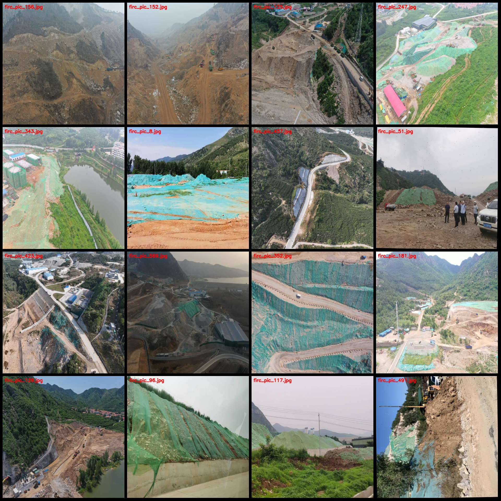
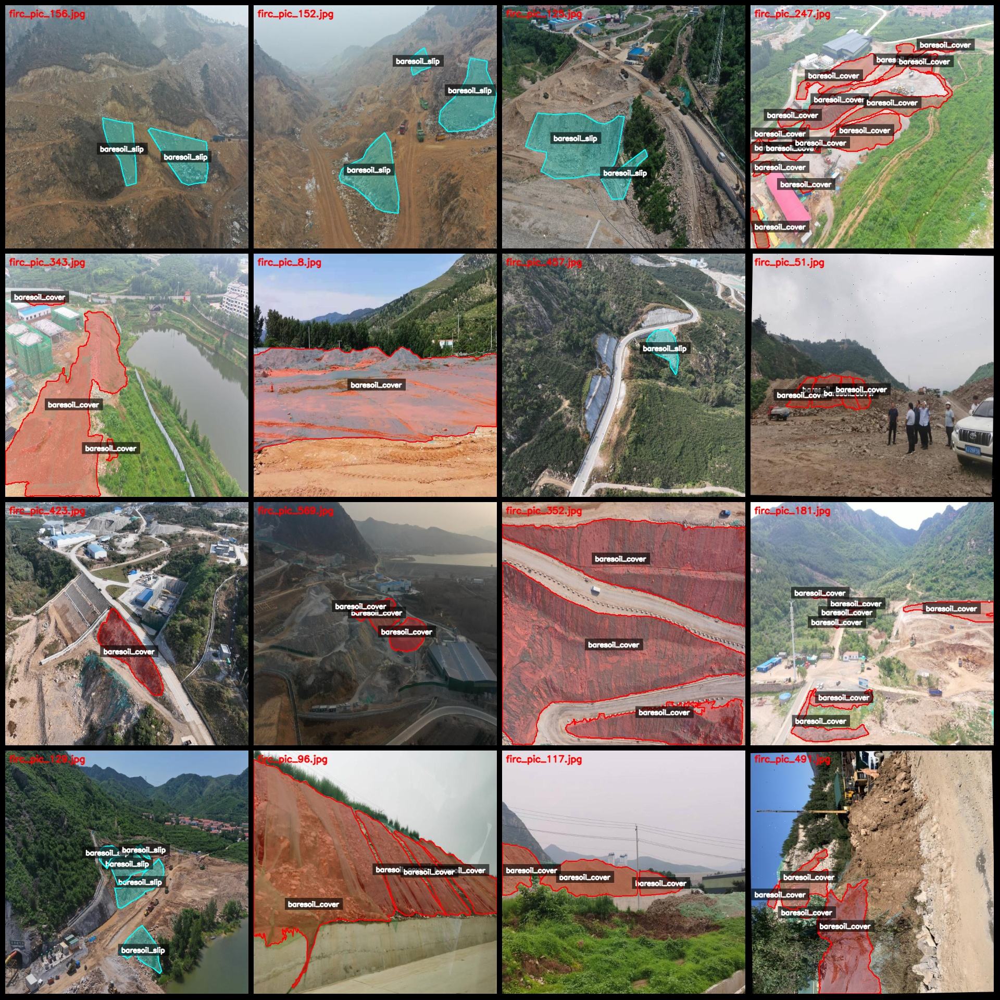
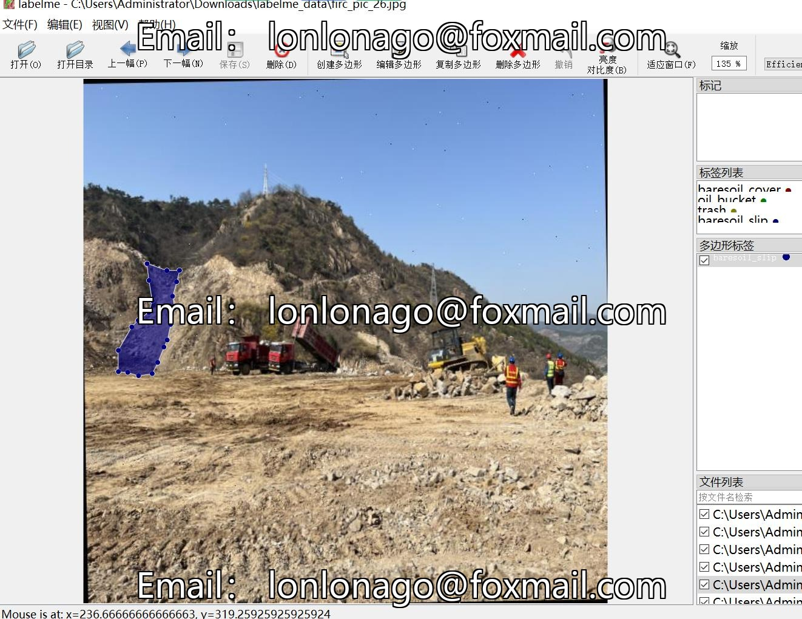

# Drone-Viewed Bare Soil Coverage Identification and Segmentation Dataset in LabelMe Format with 592 Images of 4 Categories

Dataset Format: LabelMe format (excluding mask files, only including JPG images and corresponding JSON files)

Number of Images (JPG file count): 592
Number of Annotations (JSON file count): 592
Number of Annotation Categories: 4
Annotation Category Names: ["baresoil_cover", "baresoil_slip", "oil_bucket", "trash"]

Each Category's Number of Boxes:
- baresoil_cover (Bare Soil Coverage): Count = 1748
- baresoil_slip (Bare Soil Slippage): Count = 680
- oil_bucket (OilBucket): Count = 21
- trash (Trash): Count = 79
Total Boxes: 2528

Using Annotation Tool: labelme=5.5.0

Image Resolution: 640x640
Annotation Rules: Polygon box is drawn for the category

Important Note: This dataset can be opened and edited using LabelMe, but the JSON dataset needs to be converted into either Mask or YOLOF/COCO format for semantic segmentation or instance 
segmentation.

Special Remark: This dataset does not guarantee the accuracy of the trained models or weight files.

Image Preview:
Annotation Examples:
Original Images (randomly selected 16 images):
Annotation drawing results:
LabelMe editing image examples:

## Images

Here is a pay link on Stripe ( https://buy.stripe.com/3cs8yP7sY87d0vu9AB ). Please contact me lonlonago@foxmail.com after funding $89, and I will send you a complete data files , thank you!

